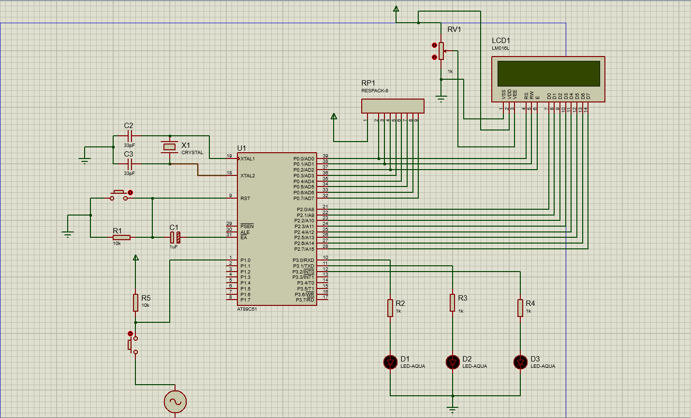
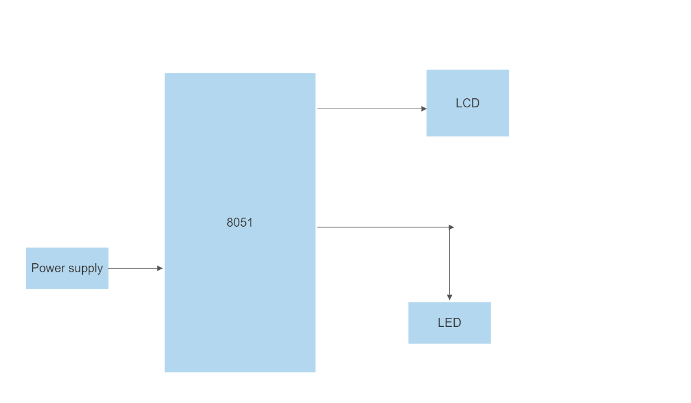

# Automatic-traffic-light-system

## Introduction
This project was created using C language with Keil as the compiler and AT89C51 simulation as the microprocessor. This project uses lcd display for showing the traffic signs and three led-aquas for interfacing the traffic lights at an interval of 5 secs. The time can be suitably changed for real-world applications. This is a low-cost automatic traffic light system that was made to practice and subsequently hone my skills in 8051.

## Working Principle
This is an automatic traffic light system that has a time interval of 5 secs between each lights as well as describe the messages on the led. Although the idea of displaying messages on the lcd may seem unnecessary but many colorblind drivers are often said to have come across problems with identifying the lights. Hence I thought that displaying messages on the lcd would be more feasible.

## Circuit


## Components Required
- 1 x AT89C51
- 1 x CAP-ELEC
- 1 x CRYSTAL
- 1 x RESPACK-8
- 1 x BUTTON
- 1 x LM016L
- 1 x MINRES10K
- 2 x 33pF CAP
- 3 x LED-AQUA

## Code
```
/* Main.c file generated by New Project wizard
 *
 * Created:   Wed Jul 6 2022
 * Processor: AT89C51
 * Compiler:  Keil for 8051
 */

#include <reg51.h>
#include <stdio.h>

//lcd initialization
sbit rs= P0^0;
sbit rw= P0^1;
sbit en= P0^2;

//led initialization
sbit led_1= P3^0;
sbit led_2= P3^1;
sbit led_3= P3^2;

//start button
sbit start=P1^0;

void lcddta(unsigned char [],unsigned char);//lcd data function
void delay(unsigned int);//delay of 1 sec
void lcdcmd(unsigned char);//lcd command function
void lcdinit(void);//lcd initialization commands


//lcd data function
void lcddta(unsigned char a[],unsigned char len){
   unsigned char x;
   for(x=0;a[x]!='\0';x++){
      P2=a[x];
      rs=1;
      rw=0;
      en=1;
      delay(1000);
      en=0;
   }
}

//lcd cmd function
void lcdcmd(unsigned char p){
   P2=p;
   rs=0;
   rw=0;
   en=1;
   delay(1000);
   en=0;
}

//delay command
void delay(unsigned int k){
   int i,j;
   for (i=0;i<10;i++){
      for (j=0;j<k;j++){
      }
   }
}

//lcd commands initialization
void lcdinit(void){
   lcdcmd(0x38);
   lcdcmd(0x0e);
   lcdcmd(0x01);
   lcdcmd(0x06);
   lcdcmd(0x80);
}

//main function
void main(void){
   led_1=0;
   led_2=0;
   led_3=0;
   while(start==1){
      lcdinit();
      lcddta("Stop",4);
      led_1=1;//giving high pin to the led
      delay(50000);//a delay of 50 sec
      led_1=0;
      lcdinit();
      lcddta("Standby",7);
      led_2=1;
      delay(50000);
      led_2=0;
      lcdinit();
      lcddta("Go",2);
      led_3=1;
      delay(50000);
      led_3=0;
   }
}
```
## Flowchart


## Conclusion
This project was created with dual purpose of displaying the messages on the LCD as well as glowing the required LED for controlling the traffic. The LCD messages were created keeping in mind the colorblind drivers who may have a hard time recognising the traffic colors therein.

